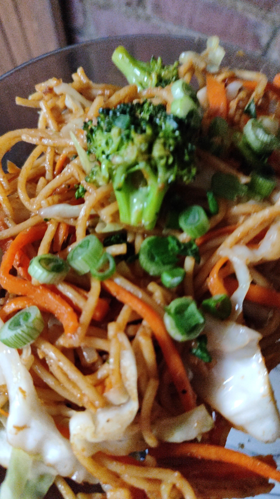

# Chow Mein de Pollo Y Verduras

## INGREDIENTES

- 250g de fideos
- Pechuga de pollo
- 1 diente de ajo
- ¼ de cebolla
- Jengibre
- Champiñones
- Zanahoria
- Brócoli
- Pimientos
- Mantequilla
- 80 ml de Salsa de soya 
- 50 ml de Salsa Maggi
- 3 limones
- Sal y Pimienta al gusto

## PREPARACIÓN

- Cocer los fideos y reservar
- Cortar el pollo en cubos
- Cocinar los cubos de pollo y condimentar con sal y pimienta al gusto 
- Cortar las verduras en julianas y los champiñones en cuartos
- Mezclar la salsa de soya, el jugo Maggi, el jugo de limón, el ajo y ralladura de jengibre
- Sofreír las verduras en mantequilla
- Agregar los fideos, el pollo y mezclar todo junto, agregando la mezcla de salsas
- Terminar de condimentar con sal y pimienta al gusto y servir

