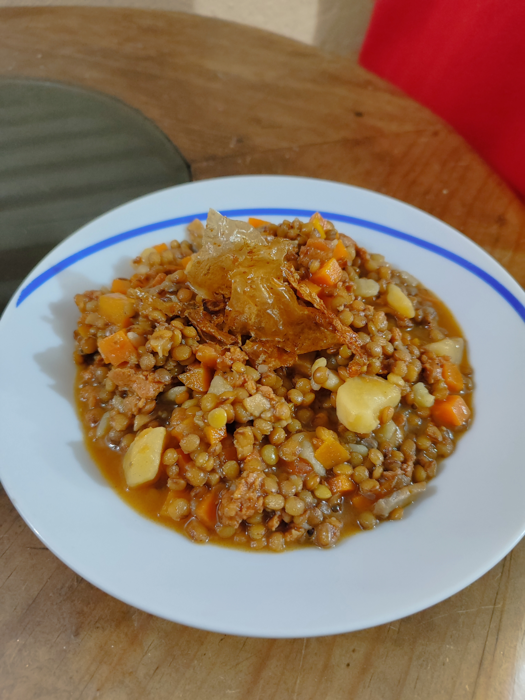

# Guiso de Lentejas con Champiñones

## INGREDIENTES

- 500g de lentejas
- 300g de champiñones
- 200g de chorizo
- 2 zanahorias
- 2 papas
- 1/2 cebolla
- 2 jitomates
- 1 diente de ajo
- Sal al gusto

## PREPARACIÓN

- Remojar las lentejas en caso de ser necesario.
- Machacar el ajo.
- Retirar la cáscara de las papas y reservar.
- Cortar en cuadros las papas, las zanahorias y los jitomates.
- Cortar la cebolla en julianas.
- Cortar el chorizo en pequeños trozos.
- Cortar los champiñones en laminas.
- Freír la cáscara de las papas y reservar.
- Sofreír la cebolla y agregar el ajo.
- Agregar el chorizo hasta dorarlo, después agregar los champiñones.
- Agregar la papa, la zanahoria y el jitomate.
- Mover el sofrito y condimentar con sal.
- Agregar las lentejas y cubrir con agua.
- Cocinar durante media hora o hasta que las lentejas estén tiernas.
- Decorar con la cáscara de papa y condimentar al gusto.

