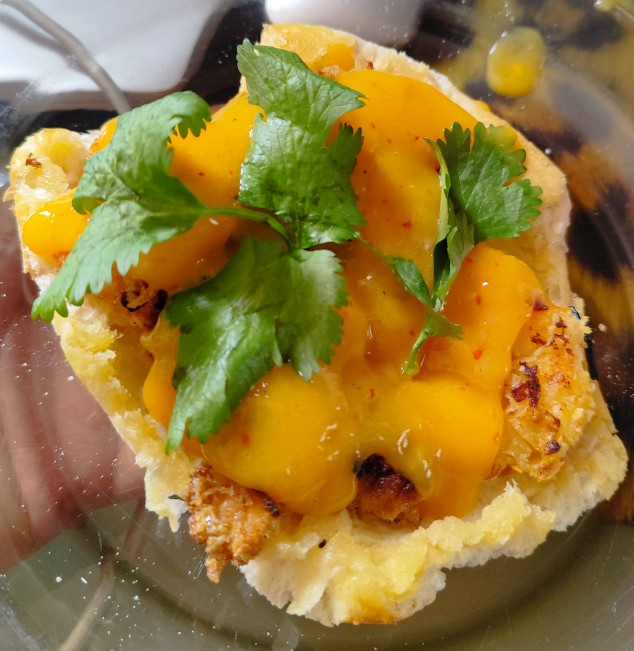

# Molletes de Camarones Empanizados con Coco y Salsa de Mango

## INGREDIENTES

- 2 bolillos
- 500g de camarón 
- ½ taza de cilantro picado
- 1 taza de harina
- 2 huevos
- 50g de coco rallado
- 50g de Panko (o pan molido)
- 5 mangos cortados
- ¼ taza de vinagre blanco
- 2 chiles de árbol
- 180g de mantequilla
- ½ cebolla picada
- 1 diente de ajo picado
- 2 cucharadas de azúcar 
- Sal y pimienta al gusto
- [Opcional] 50g de queso manchego

## PREPARACIÓN 

- Limpiar los camarones y retirar los caparazones
- Pasar los camarones al harina, sacudir el exceso
- Batir los huevos, pasar los camarones al huevo
- Mezclar el coco rallado y el Panko, empanizar los camarones con la mezcla
- En un sartén, agregar la mantequilla y derretir
- Agregar la cebolla y el ajo al sartén 
- Freír los camarones empanizados a fuego medio hasta dorarse junto con la mantequilla, cebolla y ajo
- Retirar los camarones y colocar en papel absorbente para retirar exceso de grasa
- Partir los bolillos a la mitad horizontalmente
- Bañar la parte superior de los bolillos con el resto del sofrito de mantequilla
- Licuar el mango y el chile junto con el vinagre y el azúcar, condimentar con sal y pimienta
- Colocar los camarones sobre los bolillos, bañar con la salsa de mango
- [Opcional] Agregar queso manchego por encima de los camarones
- En una sartén tapada, calentar el mollete hasta alcanzar un bolillo crujiente
- Decorar con cilantro

