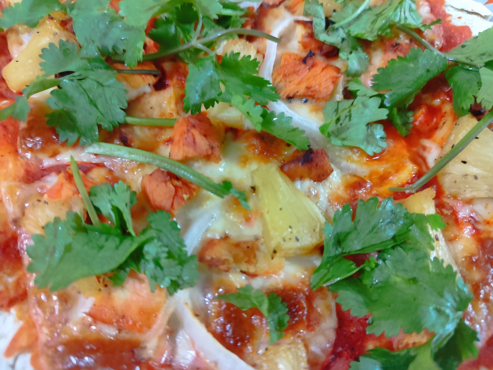

# Pizza de Pollo al Pastor

## INGREDIENTES

- Harina
- 1 cucharada de polvo para hornear
- 1 cucharadita de sal
- 2 pizcas de orégano
- 3 chiles guajillos remojados sin semilla
- 2 dientes de ajo
- 50g de achiote en barra
- 1 taza de jugo de naranja
- 1/4 de taza de vinagre blanco
- 1 pizca de comino
- 3 pimientas gordas
- 250g de filetes de pollo
- 2 cucharadas de aceite vegetal
- 250g de queso manchego en láminas
- 1 piña cortada en rebanadas
- 1/2 cebolla cortada en julianas
- Cilantro al gusto
- Limón al gusto

## PREPARACIÓN

- Agregar a la batidora 3 tazas de harina, el polvo para hornear, la sal, una pizca de orégano y una taza de agua tibia
- Batir durante 5 minutos o hasta formar una masa homogénea y reservarla
- Licuar los chiles guajillos, el ajo, el achiote, el jugo de naranja, el vinagre, el comino, el resto del orégano y la pimienta gorda
- Marinar los filetes de pollo en los ingredientes licuados durante una hora
- Freír en una sartén a fuego medio la carne marinada. Sazonar con sal y pimienta
- Cortar en cuadros el pollo y reservar
- Asar las rodajas de piña, condimentar con sal y pimienta
- Cortar las rodajas de piña en trozos pequeños y reservar
- Enharinar una superficie plana y extender la masa hasta alcanzar un grosor de 3mm y la forma deseada para la pizza (cortar de ser necesario)
- Sobre la masa extendida colocar el queso sobre la pizza, agregar el pollo marinado, los trozos de piña y cebolla
- Hornear a 200° durante 15 minutos o hasta que la pizza esté hecha
- Decora con cilantro. Servir con limones al gusto 

